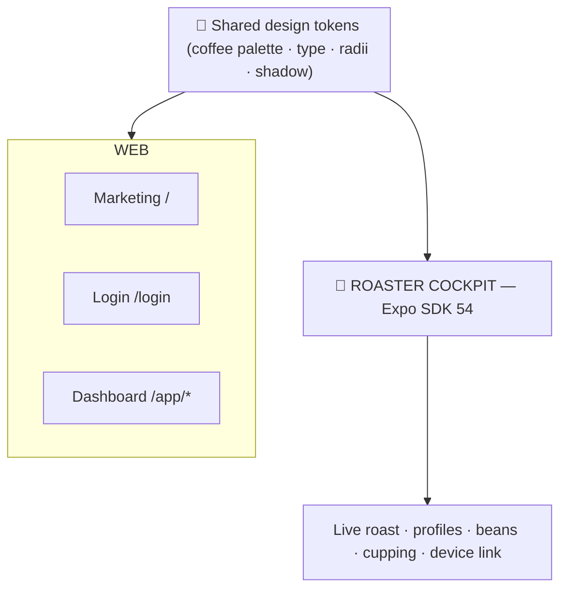
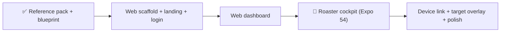

# 15 — **GenioRoasters** · The Roaster's Cockpit

### *one design system · two surfaces* — a **web** dashboard + marketing site, and an **Expo** mobile **cockpit** for live coffee roasting

> Built the same way we shipped **NeoGenesis** — extract the UI **1:1 from Figma**, stand up the proven **Vite + React + TS + Tailwind v4** web scaffold, then extend into an **Expo SDK 54** app. Here the **mobile cockpit is the hero** (you use it standing at the roaster), with a **web dashboard + marketing site** as the companion.

**Status:** ✅ **SHIPPED** (see box below) · **Type:** Vibe-coding springboard · **Design source:** Figma `Dev-Ready · Genio Roasters · Final UI` (`x6NZnbTFzcGU9DCvYHIftH`) · **Origin:** Ideas Backlog **B2 — "Roast Companion"** · **Date:** 2026-07-23

---

> ## 🚢 SHIPPED — build log & corrections (2026-07-23)
>
> **Links**
> | Deliverable | URL | Proof |
> |---|---|---|
> | GitHub repo | <https://github.com/michaelddmanuel/genioroasters-proroast> | pushed `main` |
> | Web cockpit (live) | <https://proroast-web.vercel.app> | HTTP 200 · deep routes `/live` `/schedule` 200 · JS bundle `application/javascript` |
> | Mobile companion, web export (live) | <https://proroast-app.vercel.app> | HTTP 200 · Expo bundle `application/javascript` |
>
> **⚠️ Blueprint correction (discovered at capture):** the assumed two-group split below (§0, §3, §11) was **wrong**. The Figma file is **ONE desktop web application** — *"ProRoast Evolution"* by Genio Roasters, an operator cockpit for their drum roasters. There are **no mobile frames**. What shipped:
> - **`web/` — 1:1 recreation** (Vite + React 19 + TS, hand-rolled CSS tokens, no Tailwind): Sign In/Up/Reset (photo split-layout) · **Live Roasting** (standby + active: dual-pane SVG chart, live value tags, phase bar, crack histogram, batch queue, Save-profile drawer, util rail) · Roasting Profiles (+ Edit drawer) · Schedule (+ Add-session form w/ computed batches: 200 kg → 57 × 4 kg = 228 kg, exactly as designed) · Stock (+ Add stock) · User Management (inferred; no frame).
> - **`mobile/` — ADAPTED companion** (Expo SDK 54 · RN 0.81.5 · react-native-svg): Live / Queue / Profiles / Stock tabs, same tokens + data + sim engine. Not 1:1 (nothing to be 1:1 *to*).
> - **Simulated-roast engine** (`web/src/sim/roast.ts`, shared to mobile): seeded PRNG, 18:30 roast, bean/air/exhaust/drum + RoR + cracks + fan/power/RPM; demo runs at 14× (~80 s). Zero hardware, read-only telemetry (safety line held).
> - **Screen inventory (as-shipped):** signin ☑☑ · live-standby ☑☑ · live-active ☑☑ · save-profile drawer ☑☑ · profiles+edit ☑☑ · schedule ☑☑ · add-session ☑☑ · stock ☑☑ · add-stock ☑☑ · users ☑ (inferred) — Built ☑ / Verified-vs-reference ☑; 34 reference PNGs in `design-reference/`.
> - Design quirks preserved deliberately: "Rosting profiles", "Casta Rica Fancy" (present in source frames).
> - **Round 2 (user-flagged frames 35–38, captured to `design-reference/`):** ✅ Roasting Profiles **table page** (frame 36: tabs, roaster avatars, 10-star scores, descriptions) with row → detail navigation · ✅ delete-confirmation modals for roast profiles (frames 35/38 verbatim copy incl. "Raost") and users · ✅ Add User drawer + working add/delete · ✅ batch queue **drag-and-drop reorder** (statuses recompute by position) · ✅ sidebar **collapse/expand toggle** (full menu ↔ icon rail, frames 36/37) — all verified in-browser and redeployed.
> - **Rounds 3–6 (frames 39–44 + interaction passes):** ✅ util-rail switches **6 right-side panels** (Session Overview · Machine Settings · Alerts & Events live feed · Roast Notes w/ save · Roast Profile Data · Probes), click-again-to-close · ✅ full **mode system** Preheat → Roasting → Cooldown → Standby (colored chips + bean-tile dot, frames 39/41) on web **and** mobile · ✅ header **session-overview mega-dropdown** (In queue / Completed / Current, frame 44) with click-away · ✅ queue group expander (frame 43) · ✅ Add Profile drawer + Save note wired · ✅ banner fills edge-to-edge incl. behind the sidebar's rounded corner · ✅ built out **Support** (FAQ + contact), **Machine Settings**, **Settings** (tabbed), **Profile** (sidebar user block links to it) — zero stubs remain. 13 web routes live, all 200.
> - **Brand note:** Genio Roasters is a real manufacturer; repo README carries an unaffiliated-recreation disclaimer.

---

## 0. TL;DR — two surfaces, one system

A **roaster's cockpit**: log roast profiles, watch **live temperature + Rate-of-Rise (RoR)** curves, save/replay profiles for repeatability, track green-bean inventory, and rate the cup to close the loop. Optional **Bluetooth/serial link** to roaster thermocouples (Artisan-style) for live curves.

1. **Mobile cockpit (Expo SDK 54) — the hero.** The tool you hold at the machine: live BT/ET temps, RoR gauge, phase timeline (charge → turning point → first crack → drop), development-time ratio, event buttons, and a **target-profile overlay** to "chase the curve."
2. **Web — Marketing home + Login + Dashboard.** A stunning **product/landing page** at `/`, the **login** at `/login`, and the **roastery dashboard** under `/app` (roast log, profile library, green-bean inventory, cupping scores, analytics).
3. **Shared design tokens.** One warm coffee/roast palette feeds web **and** native so both surfaces read as one product.

> ### ✅ Decisions locked (v1)
> - **Brand:** *GenioRoasters* — warm espresso browns + an **ember/amber** accent on cream "paper", precise craftsman feel. Exact tokens extracted from Figma during the reference-pack step.
> - **Web styling:** Tailwind CSS v4 (design tokens in `@theme`) on Vite + TS.
> - **Mobile:** **Expo SDK 54** (React 19.1 · RN 0.81 · Expo Router 6), **one app** — the roaster cockpit.
> - **Web IA:** marketing site at `/`, dashboard at `/app/*`, login at `/login`.
> - **Data:** mock/local for the demo; a **simulated-roast engine** so the whole thing demos with **zero hardware**; typed data layer as the API contract.
> - **Fidelity:** pixel-perfect 1:1 to Figma (the 1:1 contract in `/figma-kickoff` is binding).

---

## 1. The product — what GenioRoasters is

A **companion app for coffee roasting**. Roasters run a batch on a drum roaster, monitor the **bean-temp curve and its RoR** in real time, mark the roast milestones (charge, turning point, first crack, drop), and save the result as a **profile** they can replay for repeatability. Green-bean lots and cupping scores close the loop from raw bean → roast → taste → reorder.

| | Detail |
|---|---|
| **Who** | Coffee roasters — home/hobby through small commercial roasteries — and roastery managers |
| **Core objects** | Bean (green lot) · Roast · Curve (temp + RoR) · Profile · Cupping/Score · Device (thermocouple) · Roaster (user) |
| **Core loop** | Load green → charge → monitor live curve (TP · FC · dev %) → drop → log profile → cup & score → replay/refine → reorder green |
| **Vibe** | Warm, tactile, precise — a craftsman's instrument. Espresso browns + ember accent, cream paper, data-dense but calm charts |

**Roasting vocabulary (the domain the UI speaks):** Charge temp · Turning Point (TP) · Drying / Maillard / Development phases · First Crack (FC) · **Development-Time Ratio (DTR** = time after FC ÷ total, typically 15–25%) · Drop temp · **Rate-of-Rise (RoR** = °/min slope of bean temp — the signal roasters live by) · Bean Temp (BT) vs Environmental Temp (ET) · roast level / Agtron · SCA cupping score.

---

## 2. ♻️ What we carry over (the reusable machinery)

Nothing of the GenioRoasters **UI** exists yet — it's extracted fresh from its own Figma. What we **reuse** is the proven, known-good machinery from NeoGenesis so we move fast:

- **The stack** — Vite + React 19 + TS + **Tailwind v4** (`@theme` tokens) on web; **Expo SDK 54** on mobile (exact version matrix below).
- **The component-kit pattern** — Untitled-UI-style primitives (Button, Badge, Input, Card, Tabs, KpiCard, Drawer, Checkbox, Logo) re-skinned to the coffee palette.
- **The charts approach** — `recharts` on web, hand-built `react-native-svg` on mobile for a matched look with no heavy dep.
- **The kickoff workflow** — `/figma-kickoff`: **reference pack FIRST**, the **1:1 contract**, per-screen side-by-side verification, screen inventory + asset manifest, then ship.

> Full technical detail will live in `BLUEPRINT.md` inside the build repo. This document is the **master vision** across both surfaces.

---

## 2.5 🎯 How we capture 1:1 from Figma (the method — baked in here, not just linked)

The single highest-leverage habit from NeoGenesis: **refuse to write code until `design-reference/` holds a numbered PNG of every one of the 34 frames, and you've approved the count.** Every "not as per" failure last time came from building blind. This is the exact loop (it lives in `/figma-kickoff` too, but it's written out here so this blueprint is self-contained):

**Step 1 — Reference pack FIRST (no API quota).** The file is link-shared, so it opens **anonymously** in the web viewer. Playwright loop, one node at a time:

```
goto   figma.com/design/x6NZnbTFzcGU9DCvYHIftH/?node-id=<X-Y>
wait   ~6s for the canvas to render
key    Escape         # deselect
key    Shift+2        # zoom to selection (fit the frame)
shot   design-reference/NN-<slug>.png
```

~9s/frame → all 34 frames in a few minutes.
> ⚠️ **Never batch the Figma REST `/v1/images` API** — it can hard-lock the token for **days** (Retry-After 56h+). If you must use it, test **one** image first.

**Step 2 — Offline fallback (if a frame won't render).** Figma → *Save local copy* → the `.fig` is a **ZIP**: `images/` holds every embedded asset by hash, and `canvas.fig` parses with the fig-kiwi miner (use `kiwi-schema` directly — the `fig-kiwi` npm package is broken).

**Step 3 — Contact sheet + count.** Stitch the PNGs into one sheet, confirm **34 frames**, get ✅ before any code. If a frame can't be captured, say so — never skip it silently.

**Step 4 — The 1:1 contract (binding).** *1:1 = a client can't tell the recreation from the original.*
- Build each screen **from its reference PNG** (actually look at it) + node data for exact padding/color/type — never from memory or JSON alone.
- **Extract & use the real embedded assets** (logo, photos, icons) — never a generated lookalike.
- **Transcribe the real copy** — no lorem, no paraphrase.

**Step 5 — Per-screen verification loop** (run for every row of the §11 inventory): view PNG → pull node data → build with real copy + assets → screenshot the built route at the design's viewport → **side-by-side compare** → list every discrepancy (spacing, color, font, icon, copy, asset) → fix → re-compare clean → flip the row to **Verified-1:1**. Code review alone never marks a screen done.

---

## 3. The two surfaces



- **Same identity, two form factors.** Mobile is the **cockpit** you use at the machine; web is the **roastery HQ** (planning, library, inventory, analytics) plus the go-to-market face.
- **One token source** keeps them unified; each surface uses the right idioms (recharts on web, `react-native-svg` on mobile).

---

## 4. Tech stack

| Layer | Web | Mobile (Roaster Cockpit) |
|---|---|---|
| **Runtime** | Vite 8 + React 19 + TS | **Expo SDK 54** · React 19.1 · React Native 0.81 |
| **Navigation** | react-router-dom | **Expo Router 6** (file-based) |
| **Styling** | Tailwind CSS v4 (`@theme` tokens) | RN `StyleSheet` from shared token module |
| **Charts** | recharts (curve + RoR + radar) | `react-native-svg` (hand-built curve/RoR/gauge) |
| **Icons** | lucide-react | `@expo/vector-icons` (Ionicons) + custom SVG |
| **State** | React Context (Auth, Toast, Roast) | React Context + `AsyncStorage` persistence |
| **Auth (demo)** | mock, localStorage | mock, `AsyncStorage`; biometric unlock (`expo-local-authentication`) |
| **Device link** | Web Serial / Web Bluetooth (desktop) | **BLE** via `react-native-ble-plx` — **needs a dev build, not Expo Go** |

> **Expo SDK 54 version matrix (locked, known-good):** `expo ~54`, `expo-router ~6.0`, `react 19.1.0`, `react-dom 19.1.0`, `react-native 0.81.5`, `react-native-safe-area-context ~5.6`, `react-native-screens ~4.16`, `react-native-svg 15.12.1`. SDK 54 **requires React 19**. Preempt two known crashes: RN 0.81 Fabric needs React 19 (not 18.3); and Expo Router `<Link asChild>` must not forward RN style arrays to the DOM on web — flatten with `StyleSheet.flatten`. Add `babel-preset-expo` as a devDep; verify headlessly with `expo export -p web`.
>
> **Device-link caveat:** real Bluetooth (BLE) telemetry needs a **dev build** (`expo prebuild` / EAS dev client) — it does **not** run in Expo Go or the web export. So the demo ships a **simulated-roast engine** + a **manual mode** (tap the temps) that work everywhere; real BLE is a P4 stretch.

---

## 5. 🎨 Shared design system

One token set, consumed by both surfaces. **Provisional coffee palette below — REPLACE each value with the exact Figma token during the reference-pack step (§2.5; the 1:1 contract governs).**

| Token | Provisional value (confirm vs Figma) |
|---|---|
| **Roast brown (primary)** | 950 `#1A1108` · 900 `#2A1B0E` (headers/cockpit) · 700 `#4A2F17` · 500 `#7A5230` · 300 `#B08968` |
| **Ember accent (amber/orange)** | 600 `#C2410C` · 500 `#E8842A` · 400 `#F59E0B` · 50 `#FFF7ED` |
| **Cream / paper neutrals** | bg `#FBF7F0` · surface `#F5EFE6` · line `#E7DFD1` |
| **Gray (Untitled UI)** | 900 `#101828` · 600 `#475467` · 300 `#D0D5DD` · 200 `#EAECF0` · 50 `#F9FAFB` |
| **Roast-curve semantics** | BT (bean) ember `#E8842A` · ET (env) brown `#7A5230` · RoR teal `#0BA5EC` · FC marker red `#F04438` |
| **Success / Warning** | `#17B26A` · `#F79009` |
| **Type** | Inter (UI) · **display TBD** — Poppins (match NeoGenesis) or a coffee-forward serif (Fraunces/Recoleta); confirm from Figma · ramp 12/14/16/18/24/30/36 |
| **Radii / shadow** | 6 / 8 / 12 / full · shadow-xs `0 1px 2px rgba(16,24,40,.05)` |

- **Web:** tokens in `src/index.css @theme`.
- **Mobile:** a `theme.ts` built from the same hexes — palette, spacing, typography, radii.

---

## 6. Surface A — Web (marketing + login + dashboard)

**Marketing / product home (`/`)** — advertises the platform:
- Sticky nav (logo + Features · How it works · For roasters · Sign in / Launch app)
- **Hero** — headline, subcopy, dual CTA, a **live roast-curve** hero visual, trust bar
- **Feature grid** — Live curves & RoR · Profile library & replay · Green-bean inventory · Cupping scores · Device link (Artisan-style) · Mobile cockpit
- **How it works** — Charge → Monitor → Drop → Cup → Replay
- **Mobile showcase** — the cockpit in a phone frame
- **Metrics / social proof · Pricing teaser · CTA · Footer**

**Login (`/login`)** — branded split-screen (roast-curve / coffee art).

**Dashboard (`/app/*`)** — the roastery HQ:

| Route | Purpose |
|---|---|
| `/app` — Overview | KPIs (roasts this week, avg DTR, green stock kg, avg cup score), recent roasts, quick "New roast" |
| `/app/roasts` — Roast Log | Sortable table of roasts → **roast detail** with curve replay, phases, notes |
| `/app/profiles` — Profile Library | Saved target profiles → detail / duplicate / set as target |
| `/app/beans` — Green Inventory | Lots (origin, process, weight, cost) → bean detail; low-stock flags |
| `/app/cupping` — Cupping & Scores | SCA-style score sheets tied to roasts |
| `/app/analytics` — Analytics | RoR consistency, DTR distribution, roast-level trends |
| `/app/settings` — Settings | Profile, roastery, units (°C/°F), device defaults |

---

## 7. Surface B — 📱 Roaster Cockpit (Expo SDK 54) — the hero

The tool you hold at the machine. Tab navigation:

| Tab / screen | Purpose |
|---|---|
| **Login + biometric unlock** | Branded login → Face/Touch ID re-entry |
| **Live Roast (cockpit)** | Live **BT/ET** temps, **RoR gauge**, phase timeline (charge · TP · FC · drop), **DTR %**, event buttons, real-time **curve** + optional **target-profile overlay** |
| **Roasts** | Log of past roasts → roast detail (curve **replay**, phases, notes, cup score) |
| **Profiles** | Saved profiles → set one as the **target** to chase during a live roast |
| **Beans** | Green-bean inventory (lots, weight, origin, process) → bean detail / add lot |
| **Cupping** | Score a roast (SCA-style sliders: fragrance, flavor, acidity, body, aftertaste, balance) → results |
| **Device / Profile** | Pair/manage a Bluetooth thermocouple; units; account; sign out |

Signature moves: live **RoR gauge** + **curve** via `react-native-svg`, phase **progress ring**, **haptics** on First Crack / Drop, target-profile **overlay** ("chase the curve"), a one-tap **charge/FC/drop** event bar.

---

## 8. 🔥 The Live-Roast engine & device link (the signature feature)

The thing that makes this more than a form:

- **Curve model** — sample BT/ET at ~1 Hz, compute a **smoothed RoR** (slope of BT), auto-detect/label phases, and track **DTR** live after FC is marked.
- **Events** — one-tap **Charge · Turning Point · First Crack · (Second Crack) · Drop**; each stamps time + temp onto the curve.
- **Replay & targets** — every roast stores its time-series; any saved **profile** can be overlaid as a **target curve** so the roaster chases it in real time.
- **Device link** — **Web Serial / Web Bluetooth** on desktop web; **BLE** (`react-native-ble-plx`) on mobile. BLE needs a **dev build** (not Expo Go / not web export), so:
  - **Simulated-roast engine** — a realistic curve generator (charge dip → TP → rising BT → FC → drop) so the app **demos fully with zero hardware**.
  - **Manual mode** — tap the current temp at intervals; works everywhere.
- **Safety boundary (v1):** the app is **read-only telemetry** — it **never controls the roaster's heat/gas**. Actuating a live gas/electric roaster is safety-critical and explicitly **out of scope** for v1.

---

## 9. Monorepo structure (target)

```
GenioRoasters/
├─ src/ …                       # WEB (marketing + login + dashboard)
├─ mobile/
│  └─ cockpit/                  # Expo SDK 54 app (roaster cockpit)
│     ├─ app/ (expo-router)  ├─ src/theme.ts  └─ src/components …
├─ design-reference/            # numbered PNG per Figma frame (captured FIRST)
├─ BLUEPRINT.md                 # web technical blueprint
└─ 15 — GenioRoasters … .md     # this master blueprint
```

> Standalone Expo app (its own copied `theme.ts`) — deliberately **not** a pnpm workspace, to avoid Metro/monorepo resolution pain and keep it trivially runnable with `npx expo start`.

---

## 10. Data model (shared vocabulary)

| Entity | Key fields |
|---|---|
| `Roaster` (user) | id, name, email, roastery, role, avatar |
| `Bean` (green lot) | id, name, origin, process, variety, weightKg, purchaseDate, costPerKg, notes |
| `Roast` | id, beanId, date, batchSizeG, chargeTemp, tp{t,temp}, fc{t,temp}, drop{t,temp}, dtr, roastLevel, curveId, profileId?, status, notes |
| `Curve` | id, roastId, samples[]{t, bt, et, ror}, events[]{type, t, temp} |
| `Profile` | id, name, targetCurve, beanId?, notes |
| `Cupping` (score) | id, roastId, scores{fragrance,flavor,acidity,body,aftertaste,balance,overall}, total, notes |
| `Device` | id, name, kind(BLE/serial), channels{bt,et}, status |

---

## 11. 📋 Screen inventory — all 34 Figma frames (kickoff-mandated)

> **Node IDs are exact** (from the URLs you sent). **Names + routes below are inferred from the concept and MUST be confirmed/renamed against each reference PNG** during the capture step (§2.5). A row flips to **Verified-1:1** only after the per-screen side-by-side compare in the §2.5 loop.
> **Prototype start node:** `10909:378779`.

### Group 1 — 📱 Mobile cockpit flow (`10907/10909…`)

| # | Node ID | Inferred screen (confirm) | Route | Ref PNG | Built | Verified-1:1 |
|---|---|---|---|---|---|---|
| 1 | `10909-378779` | Splash / prototype start | `/` | ☐ capture | ☐ | ☐ |
| 2 | `10909-380400` | Onboarding / welcome | `/onboarding` | ☐ | ☐ | ☐ |
| 3 | `10907-812809` | Sign in | `/login` | ☐ | ☐ | ☐ |
| 4 | `10907-812816` | Sign up / create account | `/signup` | ☐ | ☐ | ☐ |
| 5 | `10907-812807` | Home / cockpit dashboard | `/(tabs)/home` | ☐ | ☐ | ☐ |
| 6 | `10907-808641` | Live roast — pre-charge / setup | `/roast/new` | ☐ | ☐ | ☐ |
| 7 | `10907-808635` | Live roast — active curve | `/roast/live` | ☐ | ☐ | ☐ |
| 8 | `10907-813621` | Live roast — first crack | `/roast/live` | ☐ | ☐ | ☐ |
| 9 | `10907-815202` | Live roast — drop / summary | `/roast/summary` | ☐ | ☐ | ☐ |
| 10 | `10907-813619` | Roast log (list) | `/(tabs)/roasts` | ☐ | ☐ | ☐ |
| 11 | `10907-811702` | Roast detail / curve replay | `/roasts/[id]` | ☐ | ☐ | ☐ |
| 12 | `10907-807446` | Profile library | `/(tabs)/profiles` | ☐ | ☐ | ☐ |
| 13 | `10907-810865` | Profile detail / target overlay | `/profiles/[id]` | ☐ | ☐ | ☐ |
| 14 | `10907-817518` | Green bean inventory (list) | `/(tabs)/beans` | ☐ | ☐ | ☐ |
| 15 | `10907-817509` | Bean detail / add lot | `/beans/[id]` | ☐ | ☐ | ☐ |
| 16 | `10907-827882` | Cupping / score sheet | `/cupping/[roastId]` | ☐ | ☐ | ☐ |
| 17 | `10907-820655` | Cupping results | `/cupping/[roastId]/result` | ☐ | ☐ | ☐ |
| 18 | `10907-823001` | Device pairing (Bluetooth) | `/device/pair` | ☐ | ☐ | ☐ |
| 19 | `10907-823037` | Device connected / channels | `/device` | ☐ | ☐ | ☐ |
| 20 | `10907-823039` | Settings | `/settings` | ☐ | ☐ | ☐ |
| 21 | `10907-823020` | Profile / account | `/(tabs)/profile` | ☐ | ☐ | ☐ |

### Group 2 — 🖥️ Web marketing + dashboard (`9786/9789/225/9810/9833/9814/9872/10411/10697/10752…`)

| # | Node ID | Inferred screen (confirm) | Route | Ref PNG | Built | Verified-1:1 |
|---|---|---|---|---|---|---|
| 22 | `9786-234221` | Marketing landing / hero | `/` | ☐ | ☐ | ☐ |
| 23 | `9789-238237` | Features section | `/#features` | ☐ | ☐ | ☐ |
| 24 | `9789-237731` | How it works | `/#how` | ☐ | ☐ | ☐ |
| 25 | `225-8870` | Pricing / CTA | `/#pricing` | ☐ | ☐ | ☐ |
| 26 | `9789-235379` | Footer / contact | `/#contact` | ☐ | ☐ | ☐ |
| 27 | `9810-365920` | Web login | `/login` | ☐ | ☐ | ☐ |
| 28 | `9833-426321` | Dashboard / overview | `/app` | ☐ | ☐ | ☐ |
| 29 | `9814-376694` | Roast log (web table) | `/app/roasts` | ☐ | ☐ | ☐ |
| 30 | `9872-267111` | Profile library (web) | `/app/profiles` | ☐ | ☐ | ☐ |
| 31 | `10411-395604` | Green inventory (web) | `/app/beans` | ☐ | ☐ | ☐ |
| 32 | `10411-395602` | Analytics / reports | `/app/analytics` | ☐ | ☐ | ☐ |
| 33 | `10697-322700` | Cupping / scores (web) | `/app/cupping` | ☐ | ☐ | ☐ |
| 34 | `10752-355823` | Settings (web) | `/app/settings` | ☐ | ☐ | ☐ |

> If a captured frame doesn't match its inferred name/surface, **rename the row and re-route it** — don't silently skip. The **group split (1 = mobile, 2 = web) is an assumption** to confirm at capture time (see §17, open Q1).

---

## 12. 🗂️ Asset manifest (kickoff-mandated — fill during capture)

Every embedded asset must be **extracted and used as-is** (the 1:1 contract forbids generated lookalikes). `.fig` local copies are ZIPs — the `images/` folder holds every asset by hash.

| Asset | Source (node / hash) | Local file | Used where |
|---|---|---|---|
| GenioRoasters logo (full) | ▸ | `src/assets/logo.svg` | nav, login, app header |
| Logo mark | ▸ | `src/assets/mark.svg` | favicon, mobile splash |
| Hero roast-curve visual | ▸ | `src/assets/hero-curve.*` | marketing hero |
| Coffee / bean photography | ▸ | `src/assets/photos/…` | marketing, empty states |
| Roast-level / origin icons | ▸ | `src/assets/icons/…` | inventory, roast detail |
| App-store / device frames | ▸ | `src/assets/frames/…` | mobile showcase |

> Fill `▸` as frames are captured. No substitutes, no watermarked stock — CC0/owned or extracted-from-Figma only.

---

## 13. Roles & auth

- **Roaster / Owner** — full access (web dashboard + mobile cockpit).
- **Roastery team member** — shared profiles + inventory, own roasts (real build).
- **Auth (demo):** mock login on both surfaces; mobile adds biometric unlock. Real build → JWT + per-roastery scoping.

---

## 14. Roadmap (phased)

| Phase | Ships | Why now |
|---|---|---|
| **0 · Reference pack + blueprint** | PNG per frame + contact sheet + this doc | No code until the design is fully seen (the biggest 1:1 lever) |
| **1 · Web scaffold + landing + login** | Vite+React+TS+Tailwind v4, tokens from Figma, marketing `/` + `/login` | Self-contained, high-impact, establishes the design system |
| **2 · Web dashboard** | Overview, Roast Log, Profile Library, Green Inventory, Cupping, Analytics, Settings | The roastery HQ; generates the data model the app renders |
| **3 · 📱 Roaster cockpit (Expo 54)** | Login+biometric, Live Roast (simulated), Roasts, Profiles, Beans, Cupping, Device | The hero surface — live curves in your hand |
| **4 · Device link + polish** | Web Serial / BLE dev build, target-profile overlay, empty/loading states, parity | Real telemetry + one cohesive product |



---

## 15. 🔒 Security, safety & the device-data reality check

- **Not health data — but not nothing.** Roast telemetry, green-bean **costs**, and roastery data are business data: protect with the OWASP baseline on the eventual API (authz per route, input validation, rate limiting, secrets server-side).
- **Read-only telemetry in v1.** The app **never controls the roaster's heat/gas**. Actuating a live gas/electric roaster is safety-critical and out of scope — the device link ingests thermocouple readings only.
- **Bluetooth/serial pairing.** Pair explicitly, validate device identity, and treat incoming samples as untrusted input (bounds-check temps before charting). BLE needs a **dev build** — not Expo Go, not the web export.
- **Demo data only.** Mock records + a **simulated-roast engine** throughout; no dependency on real hardware to demo.
- **Biometric unlock** guards the device, not the API — still require real auth tokens in a production build.

---

## 16. My recommendations

- **Make the mobile cockpit the star** — it's the differentiator; build the web dashboard first (it defines the data model), then pour energy into the live-roast screen.
- **Ship the simulated-roast engine early** so the entire app demos with **zero hardware** and the live-curve UX can be tuned without a roaster.
- **Keep the device link read-only** (telemetry) in v1; never actuate heat.
- **Charts via `react-native-svg`** hand-built to match the web's recharts look (curve, RoR gauge, cupping radar).
- **Plan for BLE = dev build** (`expo prebuild` / EAS dev client); keep **manual + simulated** modes so Expo Go and the web export still fully work.

---

## 17. Decisions locked & open

**✅ Locked:** two surfaces (web marketing+login+dashboard + one Expo cockpit) · Expo SDK 54 · shared coffee tokens · web IA (`/` marketing, `/app` dashboard, `/login`) · pixel-perfect 1:1 · mock + simulated data.

**❓ Open (I'll default if unanswered — flagged because you were away):**
1. **Surface split of the two Figma node groups** — I assumed **group 1 = mobile cockpit**, **group 2 = web**. Confirm at capture; if group 2 is actually onboarding or a second app, I'll re-slot those rows. *(default: mobile + web as above)*
2. **Display font** — Poppins (match NeoGenesis) vs a coffee-forward serif (Fraunces/Recoleta). *(default: extract exact from Figma; provisionally Inter + Poppins)*
3. **Device link in the demo** — simulated + manual only, or a real BLE dev build. *(default: simulated + manual; real BLE as a P4 stretch)*
4. **Second mobile persona** (e.g., a customer "coffee passport" / tasting app) — include or not. *(default: not in v1)*
5. **Units** — default °C or °F, and offer a toggle? *(default: toggle, °C default)*

---

*Next step (method in **§2.5**, also in `/figma-kickoff`): **capture the reference pack** — a numbered PNG of every one of the 34 frames into `design-reference/` + a contact sheet — get the frame count ✅, then scaffold the web and build screen-by-screen with the 1:1 side-by-side loop.*
